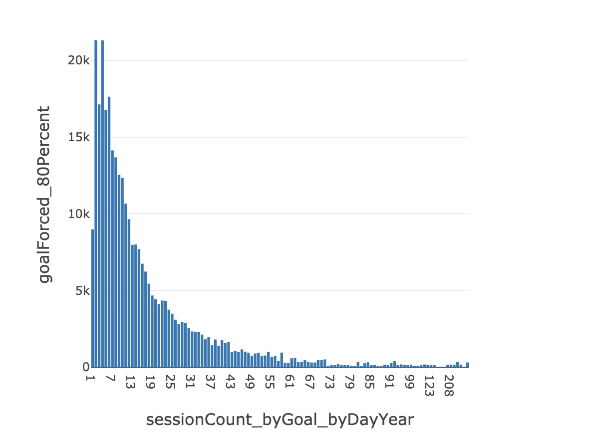
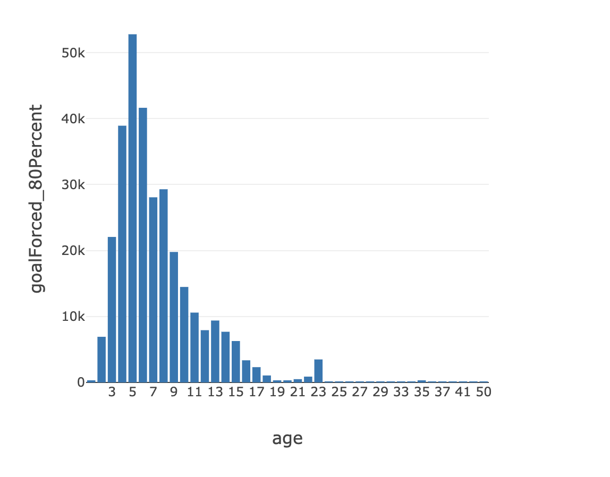
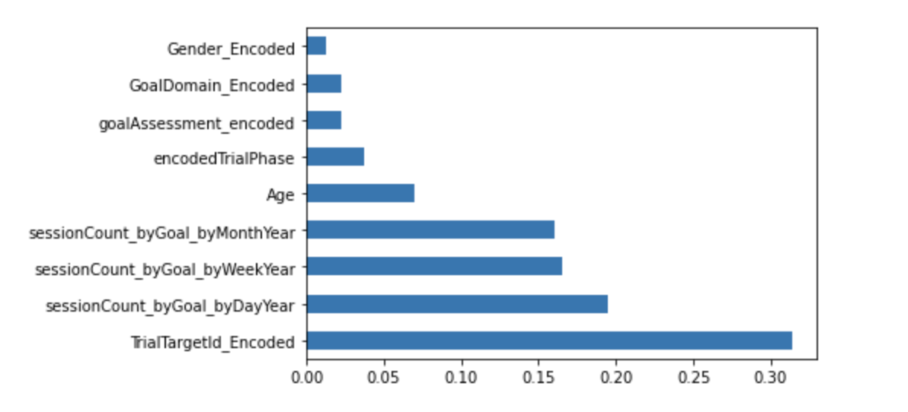
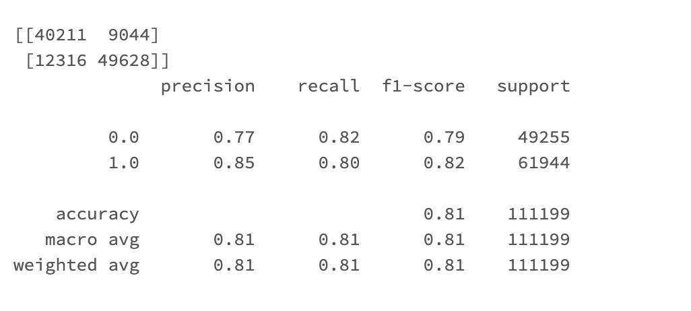
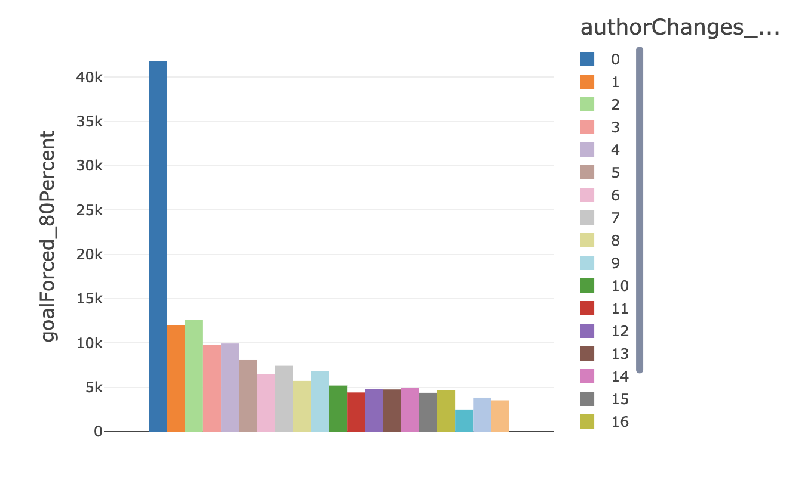

# Use Case 3 - Application of Machine Learning to ABA Data

This use case analyzes anonymized therapy data from a repository of Applied Behavior Analysis sessions and cases to draw insights which can be used by individual families to help understand the effectiveness of their programs. 

## Technologies Used

### Languages

1. Python
2. SQL

### Platforms

1. Azure Databricks
2. Sketch

### Libraries Used

1. sklearn
2. matplotlib
3. pandas
4. numpy
5. databricks MLFlow

## Solution

UI based portal for therapists, parents and clients to track the progress of goals, the journey and the metrics of the session.

## Deliverables Covered

1. Evaluation of 80% as a set goal for indication of future successes
2. Evaluation of the effect of treatment intensity on trial outcome
3. Analysis on the correlation of therapist/author based descriptors with outcomes

## Data Overview

## Part-1: Evaluation of 80% as a set goal for indication of future successes

### Objective

Find the mean goal length per goal Assessment type and see the deviation per data point

Encoded the gender field and pre processed the age field

To find the total time taken to reach the goal by multiplying the (Count of new sessions graphed (TrialGroup) per day per year) * (Bins of target periods)

We have trained a random forest classifier to predict the final goal status.
 
Given below is the feature importance distribution from the model and observations are :
1. Age has a significant amount of impact on the model.
2. Gender too has impact but comes second to age
3. Given the other features, we have found that 
4. TrialTarget Count per trial is another feature of importance.

## Part-2: Evaluation of the effect of treatment intensity on trial outcome

### Data Cleaning and Pre-processing

1. Missing values are marked as 0
2. Conversion of string columns to datetime for fields containing 'Date'
3. Conversion of categorical fields to encoded ones using Pandas Label Encoding

### Initial Data Analysis

### Feature Engineering

1. **sessionCount_byGoal_byMonthYear** : Count of sessions graphed (TrialGroup) per month per year 
2. **sessionCount_byGoal_byDayYear** : Count of sessions graphed (TrialGroup) per day per year 
3. **sessionCount_byGoal_byWeekYear** : Count of sessions graphed (TrialGroup) per week per year
4. **Gender_Encoded** : Demographic Data
5. **Age** : Demographic Data, calculated with the difference of TrialDataDate and BirthDateYear
6. **TrialTargetId_Encoded** : IDs of the target Goals
7. **GoalDomain_Encoded** : Encoded goal domain value of Adaptive, Communication and Language
8. **goalAssessment_encoded** : Encoded goal ABA assessment
9. **encodedTrialPhase** : Encoded Trial Phase (Baseline' -1,'Intervention' -2,'Generalization' -3,'Maintenance'-4)
10. **goalForced_80Percent** : The target value of outcome to 80% set goal

### Models Used

1. Random Forest
2. Decision Tree

### Feature Importance

### Confusion Matrix

### ROC Curve

### Inferences

1. The initial data analysis shows that the session count descriptors of days and weeks have a negative correlation with the goalForced_80Percent outcome, which can be interpreted as less number of sessions or more spread out sessions increase the chances of a successful outcome whereas a high number of sessions might lead to an unsuccessful outcome.

2. The feature importance from the Supervised Models show that Session Count/ Treatment Intensity descriptors
are more useful in predicting a successful outcome than the demographic features that implies that the treatment intensity/ frequency plays a more important role in the result of an outcome when compared to the gender or age of the client.

3. The Goal ID is also a useful feature but has limitations due to high cardinality which implies that if the goals are restricted or categorized, then they will be important in determining the outcome but if they aren't categorical, they might not be a suitable feature for the Machine Learning models due to their high cardinality.

4. Age is a more useful predictor for the outcome of a trial than the goal domain or trial phase which implies that the age of the clients is a contributing factor to the success outcome of the goal.

### Multiple therapist changes decreases success rates

